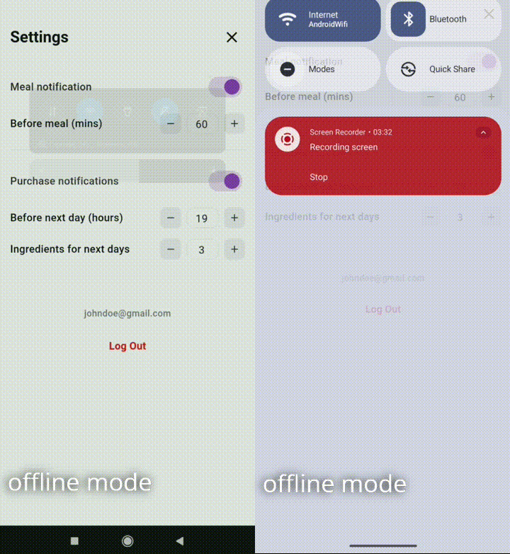
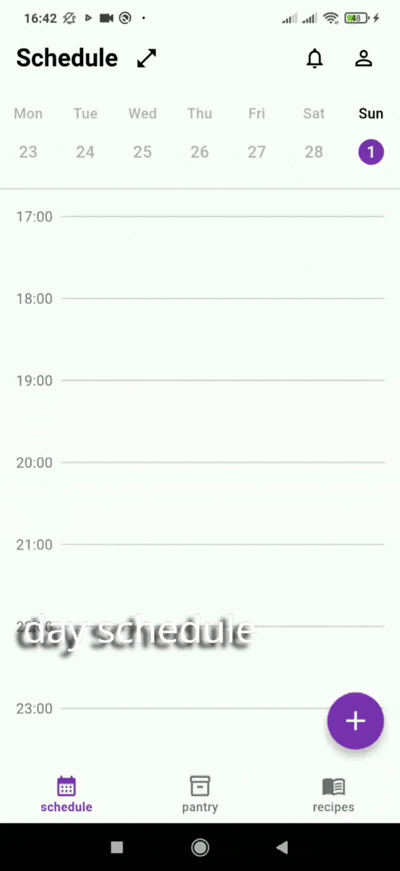
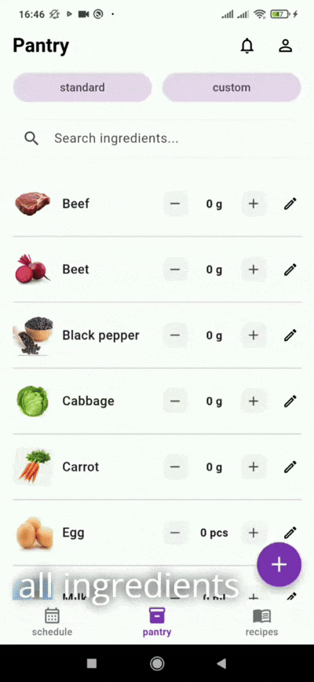

# Mealize 🍽️

Mealize (meal + realize) is a *feature-rich* Flutter mobile application designed for smart meal planning, pantry inventory management, and recipe tracking. 

Built with a focus on clean architecture, it features a robust *offline-first sync strategy* using *SQLite* and *Firebase*, ensuring a seamless user experience regardless of network connectivity.

## ✨ Core Features

<ul>
  <li>
    <details open>
      <summary><b>Offline-First Synchronization:</b> works offline using a local SQLite database and an <i>action queue database table</i>, automatically syncing with Firebase when connectivity is restored.</summary>
      <br>
      <p align="center"></p>
    </details>
  </li>
  <li>
    <details>
      <summary><b>Authentication:</b> Email/Password and <i>Google Sign-In</i> via <i>Firebase Auth</i>.</summary>
      <br>
      <p align="center"></p>
    </details>
  </li>
  <li>
    <details>
      <summary><b>Smart Schedule:</b> Interactive day/month calendar views to plan meals and attach recipes.</summary>
      <br>
      <p align="center"></p>
    </details>
  </li>
  <li>
    <details>
      <summary><b>Pantry Management:</b> Track ingredients, add customs, and use smart search.</summary>
      <br>
      <p align="center"></p>
    </details>
  </li>
  <li>
    <details>
      <summary><b>Recipe Book:</b> Create custom recipes, filter by available pantry ingredients and estimate cooking times.</summary>
      <br>
      <p align="center"></p>
    </details>
  </li>
</ul>

## 🏗 Architecture & State Management

The project follows a **Feature-First** modular architecture (auth, schedule, pantry, recipes, settings features) with a shared core layer for services and utilities.

* **State Management:** flutter_bloc (*Cubits*) with state models (Loading, Loaded, Error).
* **Data Layer:** *Repository pattern* coordinating local SQLite DB and remote Firestore data sources.
* **Cloud Sync:** *Per-user Firestore structure* with merge/update behavior and *Firebase Storage* for image handling.
* **Exception Handling:** Authentication, synchronization and data fetching *custom and built-in exceptions catching*.

## 🌐 Offline-First Architecture

* **Local-First UX:** *SQLite* serves as the *immediate source of truth* for the UI. The app instantly reads from and writes to the local database, guaranteeing no loading screens for local actions.
* **Action Queue System:** Every data mutation (create/update/delete) executes a *dual-step flow*: it *updates the specific SQLite entity table* instantly and *enqueues a JSON payload* into a dedicated *pending_actions table*.
* **Centralized SyncManager:** A dedicated background service listens to connectivity state changes. When the device comes online, it drains the queue using a *FIFO approach* (based on *createdAt* timestamps), routes payloads to Firebase Firestore or Storage, and cleans up successfully synced records.
* **Eventual Consistency:** Repositories utilize a *"local-then-remote"* read strategy. The UI gets local data instantly, after which the repository syncs pending mutations, fetches the latest cloud snapshot, merges it into the local DB, and emits the refreshed state.

> **Engineering Trade-offs & Future Scope:** For this version, conflict resolution follows a *"last successful sync/update wins"* policy rather than clock versioning. Additionally, queued actions are currently processed individually. This provides a highly robust MVP and a stable foundation for future optimizations.

## 🛠 Tech Stack

* **Framework:** Flutter (Dart)
* **State Management:** flutter_bloc, equatable
* **Backend & Cloud:** Firebase Core, Firestore, Auth, Storage, Analytics, Crashlytics
* **Local Storage:** sqflite, shared_preferences
* **Core Packages:** internet_connection_checker, image_picker, cached_network_image, intl
* **Platforms:** This project is currently built and tested on Android. Compiling for iOS requires a macOS environment with Xcode and the corresponding iOS Firebase configuration.
* **UI/UX:** Implemented strictly based on [Figma mockups](docs/images/).

## 📬 Contact
Feel free to reach out to me on [LinkedIn](https://www.linkedin.com/in/oleksalviv/) or check out my [CV/Portfolio](https://drive.google.com/file/d/1_cyGf7d0QIht9OMK_Tqwn4WVf02teNzX/view?usp=sharing).

## 🚀 Installation & Execution

The following steps work across Windows, macOS, and Linux environments:

1. **Clone the repository:**
   ```bash
   git clone https://github.com/oleksiimah/mealize.git
   cd mealize
   ```

2. **Install dependencies:**
   ```bash
   flutter pub get
   ```

3. **Start a device:**
   Launch an Android Emulator or connect a physical device. Verify that your device is recognized by Flutter:
   ```bash
   flutter devices
   ```

4. **Run the application:**
   
   If only one device is listed, run:
   ```bash
   flutter run
   ```
   *(Optional) If multiple devices are listed, specify your target:*
   ```bash
   flutter run -d <device_id>
   ```